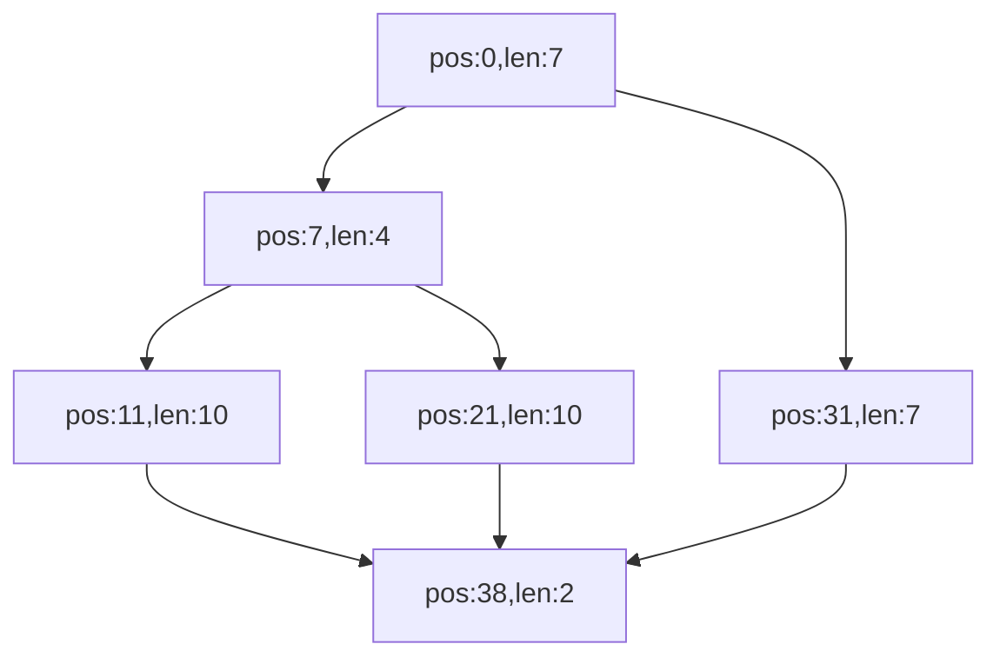

## Control Flow Graph Construction with Javassist

The `nz.ac.vuw.jenz.asm.cfg.BuildControlFlowGraph` utility extracts 
the control flow graph and represents it using the [jgrapht](https://jgrapht.org/) graph API. 
This is a thin layer on top of the cfg extraction feature of [javassist](https://www.javassist.org/).
It also contains a utility to convert graph into [mermaid](https://mermaid.js.org/) markup.


## Example

For full class def see `src/test/java/nz/ac/vuw/jenz/asm/cfg/testdata/Foo1.java`.
Also see `nz.ac.vuw.jenz.asm.cfg.BuildControlFlowGraphTests` for how to extract the CFG for 
this class.

### Source Code 

```java
String foo(int i,boolean b) {
    String s = "val";
    if (i>0) {
        if (b) {
            s = s+"1";
        }
        else {
            s = s+"2";
        }
    }
    else {
        s = s+"3";
    }
    return s;
}
```

### Byte Code 

Extracted with compiled class with `javap -c`. 
```
  java.lang.String foo(int, boolean);
    Code:
       0: ldc           #7                  // String val
       2: astore_3
       3: iload_1
       4: ifle          31
       7: iload_2
       8: ifeq          21
      11: aload_3
      12: invokedynamic #9,  0              // InvokeDynamic #0:makeConcatWithConstants:(Ljava/lang/String;)Ljava/lang/String;
      17: astore_3
      18: goto          38
      21: aload_3
      22: invokedynamic #13,  0             // InvokeDynamic #1:makeConcatWithConstants:(Ljava/lang/String;)Ljava/lang/String;
      27: astore_3
      28: goto          38
      31: aload_3
      32: invokedynamic #14,  0             // InvokeDynamic #2:makeConcatWithConstants:(Ljava/lang/String;)Ljava/lang/String;
      37: astore_3
      38: aload_3
      39: areturn

```

### Mermaid Visualisation of the CFG




