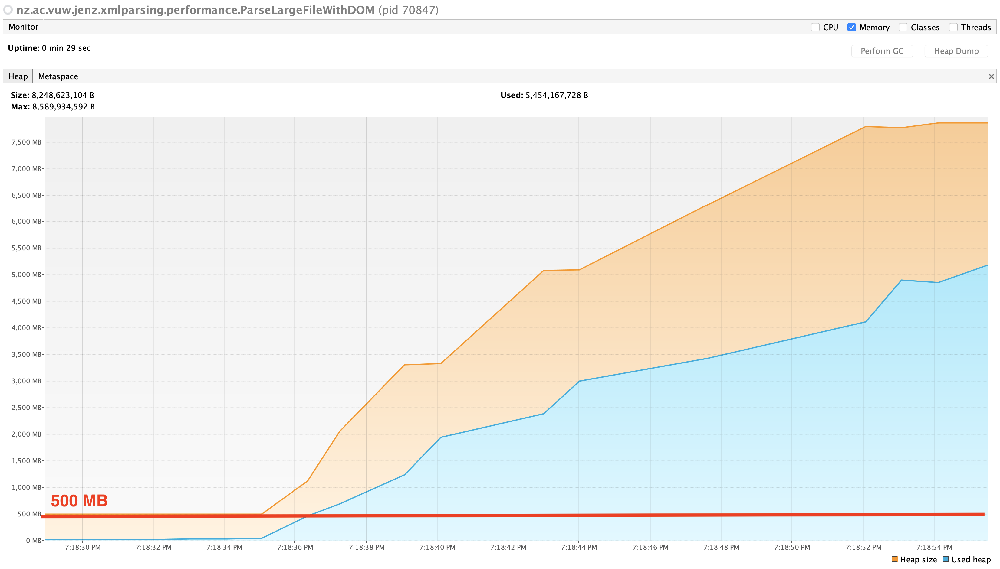
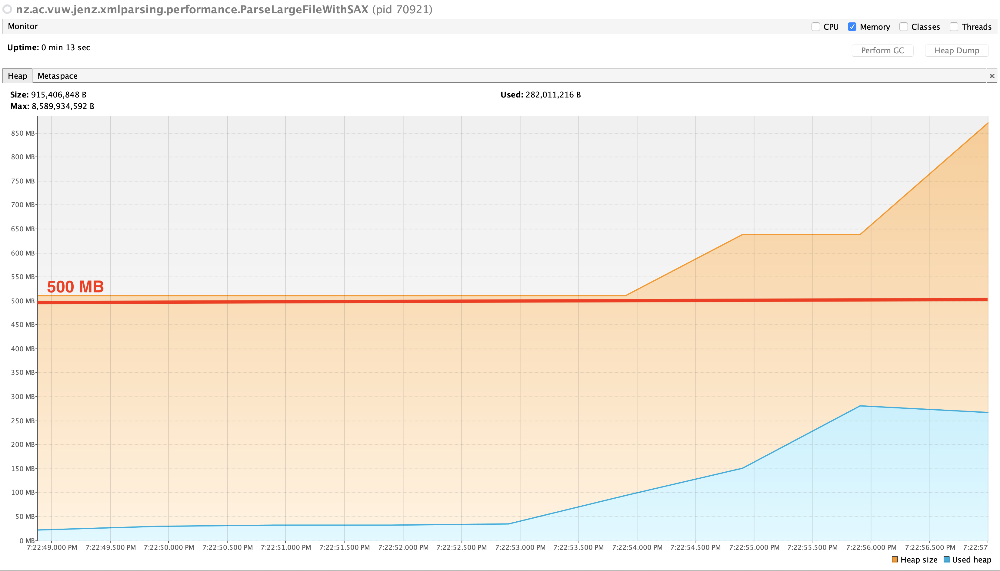

# Design Pattern Case Study: XML Parsing 

This is a collection of four simple example parsing email data represented in XML. 
Each example uses a different approach to achieve this:

 * a DOM parser (using the Composite design pattern)
 * a SAX parser (using the Observer design pattern)
 * a Stax parser (using the Iterator design pattern)
 * a XPath query (using a domain specific language / iterator pattern)
 
 All scenarios are implemented as junit test cases, with assertions describing the correct data to be extracted.
 
 There are additional scripts in `src/main/java`, package `nz.ac.vuw.jenz.xmlparsing.performance` to generate a large 
 file with randomly generated data, and parse it with a DOM and a SAX parser in order to assess its performance.
 
 Runtimes are reported on the console. For memory usage, a monitoring tool like `jvisualvm` can be used. Here are some results 
 obtained on a 2019 MacBook with a Java(TM) SE Runtime Environment (build 1.8.0_191-b12), Java HotSpot(TM) 64-Bit Server VM (build 25.191-b12, mixed mode). 
 Note the differenty scales.
 
 
 #### DOM Parsing Memory Usage (`nz.ac.vuw.jenz.xmlparsing.performance.ParseLargeFileWithDOM`)
 
 
 
 #### SAX Parsing Memory Usage (`nz.ac.vuw.jenz.xmlparsing.performance.ParseLargeFileWithSAX`)
 
 