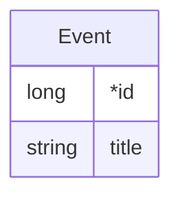
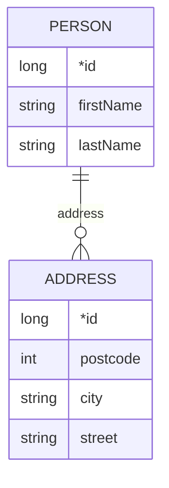

# JPA with Hibernate

JPA is the Java Persistence API. It facilitates making objects persistent using relational databases.
It is based on JDBC, but is higher-level. In particular, objects/classes are automatically mapped 
to rows/tables. Configurations and customisations are based on annotations. 

This project contains two scenarios focusing on different aspects of JPA. 
JPA is a standard with several implementations being available.
We use [hibernate](https://hibernate.org/) here, see the dependencies in [pom.xml](pom.xml) for details.
JPA/hibernate configurations can be found in `src/main/resources/META-INF/persistence.xml`.

## Scenario 1 -- Transactional Persistence (package `nz.ac.vuw.jenz.jpa.transactional`)

This scenario uses a very simple domain model consisting of only one entity class `Event`
with two attributes `id` and `title`. The `id` attribute is annotated as `@Id @GeneratedValue`. 
This means that the values will not be set by the application, but by JPA, and will be 
used to identify entities (objects mapped to database rows). 
I.e. those correspond to primary keys.



When any test that performs operation on this entity runs, the console outputs the SQL commands 
sent to the database. This includes in particular the creation of the database.

```sql
create table Events (
    id bigint not null,
    title varchar(255),
    primary key (id)
)
```

A key feature of JPA is to support transactions. This means that multiple operations that 
manipulate the persistent objects (and therefore the database) can be grouped, and a transaction
can be used to ensure that either all or none of those operations succeed. 

This is done using the following pattern:

```java
EntityManager entityManager = EntityManagerFactory.createEntityManager();
EntityTransaction transaction = entityManager.getTransaction();
try {
    transaction.begin();
    // database operations go here
}
catch (Exception e) {
    if (transaction.isActive()) {
        transaction.rollback();
    }
    throw e;
}
finally {
    entityManager.close();
}
```

A utility used for this purpose is included (`nz.ac.vuw.jenz.jpa.transactional.DB::inTransaction`), it automatically wraps java code representing
database operations in this structure. 

The same DB class has implementations of common operations used to manage persistent events, 
such as:

```java
 public boolean insertEvent(Event event) {
    System.out.println("inserting event " + event);
    return inTransaction(persistenceManager -> {
        persistenceManager.persist(event);
        return true;
    });
}
```

When tests invoke those methods, the respective SQL commands (`insert into ..` in this case)
are printed on the console. 

There are multiple test cases showing various aspects of JPA. 

| class              | tests                      | description                                              |
|--------------------|----------------------------|----------------------------------------------------------|
| `DBTests.Basic`    | several                    | basic behaviour inserting / deleting / querying          |
| `DBTests.Advanced` | `testObjectIdentity`       | multiple objects corresponding to the same row may exist |
| `DBTests.Advanced` | `testPrimaryKeyConstraint` | shows how the primary key constraint is enforced         |
| `DBTests.Advanced` | `testLazyLoading`          | shows lazy initialisation of fields                      |
| `DBTests.Advanced` | `testRollback`             | shows how a rollback works if a transaction fails        |


## Scenario 2 -- Relationships (package `nz.ac.vuw.jenz.jpa.references`)

The second scenario contains a slightly more complex domain model that has two entities
`Person` and `Address`:



The scenario uses the same setup to run commands in a transaction as in scenario 1. 

Note that the relationship is set up using annotations on the field `Person::address`.

There are multiple test cases showing various aspects of JPA.

| class         | tests                                   | description                                                                  |
|---------------|-----------------------------------------|------------------------------------------------------------------------------|
| `DBTests` | `testCreateOneFetchOneWithoutReference` | simple insert of a `Person` without an `Address`                             |
| `DBTests` | `testCreateOneFetchOneWithReference1`   | shows cascading (recursive) insert of an `Address` used by a `Person`        |
| `DBTests` | `testCreateOneFetchOneWithReference2`   | an address is not shared by two persons (as this is a one3many relationship) |
| `DBTests` | `testCreateOneDeleteOneWithReference`   | an address survives the deletion of a person, as it is associated, not owned |
